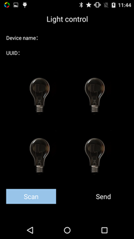
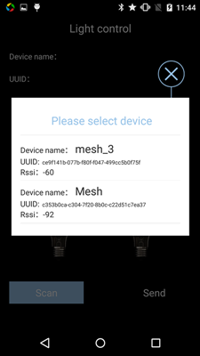
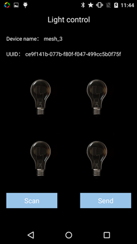
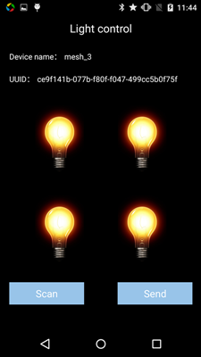

# mesh
mesh中的demo是一个灯控程序，即可以通过手机给任意一个设备发送指令，从而控制所有设备。

mesh协议demo需要配置:
1.设备的MESH_ID(app.c的宏定义)

2.广播名字用于区分不同设备(board_name，app.c中)

3.demo用的四个设备的MESH_ID分别定义为0x0001,0x0002,0x0004,0x0008.
名字也需改成不同的以方便识别。

### 效果展示


   

对应的android端程序界面效果展示。

视频链接：
[http://v.qq.com/boke/page/v/0/o/v0190dvi7ro.html](http://v.qq.com/boke/page/v/0/o/v0190dvi7ro.html)

代码解析：
[http://www.52cannon.com/bbs/thread-274-1-1.html](http://www.52cannon.com/bbs/thread-274-1-1.html)

### 代码流程介绍


这里简要介绍一下代码流程：

```
1. 系统就绪(属于`系统API`，也是应用层编程的第一入口(系统回调事件)，相当于传统的`main()`函数。) -- on_ready；
2. 设置Cannon的蓝牙广播地址 -- ble_set_adv_param；
3. Cannon开始蓝牙广播 -- ble_device_start_advertising；
4. 手机端APP和Cannon建立连接，假设使用BLE调试助手APP；
5. BLE调试助手APP给Cannon发一些数据；
6. Cannon收到数据后，触发回调事件 -- ble_device_on_message；
7. Cannon将数据原封不动的回传给手机 -- ble_device_send；
8. 手机或Cannon断开连接；
9. Cannon触发断开连接事件 -- ble_device_on_disconnect；
10. Cannon重新开启蓝牙广播 -- ble_device_start_advertising；

```

> 需记住，收发蓝牙数据，需要先要建立连接，而建立连接，需要设备先开启广播。


### 附

API文档：
[http://www.juma.io/doc/zh/embedded_api/task/](http://www.juma.io/doc/zh/embedded_api/task/)

运行环境的安装指导：
[http://www.juma.io/doc/zh/stm32_platform/cannon_env/](http://www.juma.io/doc/zh/stm32_platform/cannon_env/)

聚码官网：
[http://www.juma.io/](http://www.juma.io/)

聚码论坛：
[http://www.52cannon.com/bbs/forum.php](http://www.52cannon.com/bbs/forum.php)

聚码1000人交流群：
QQ：271927055

聚码公众号：
