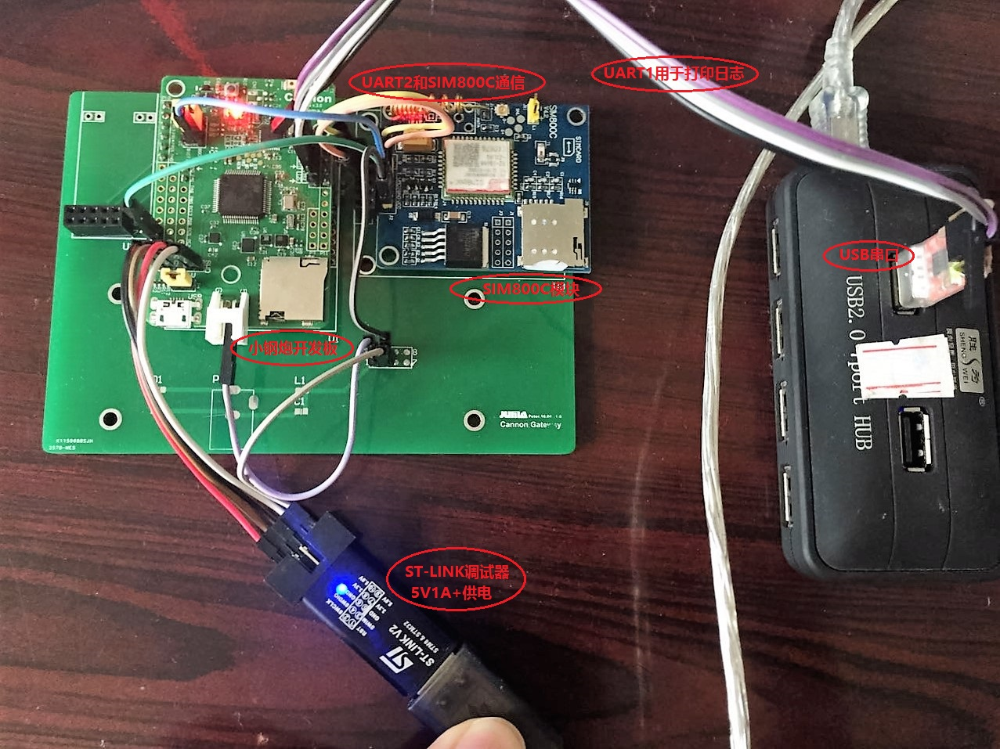
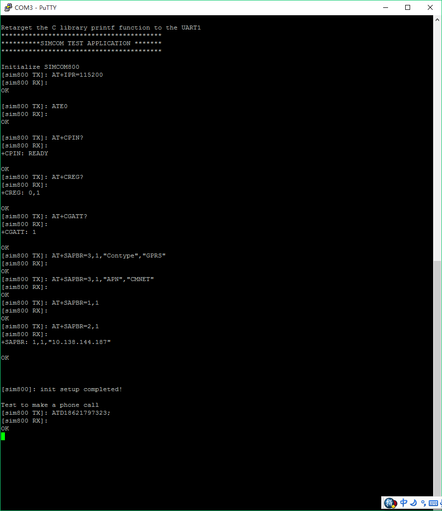
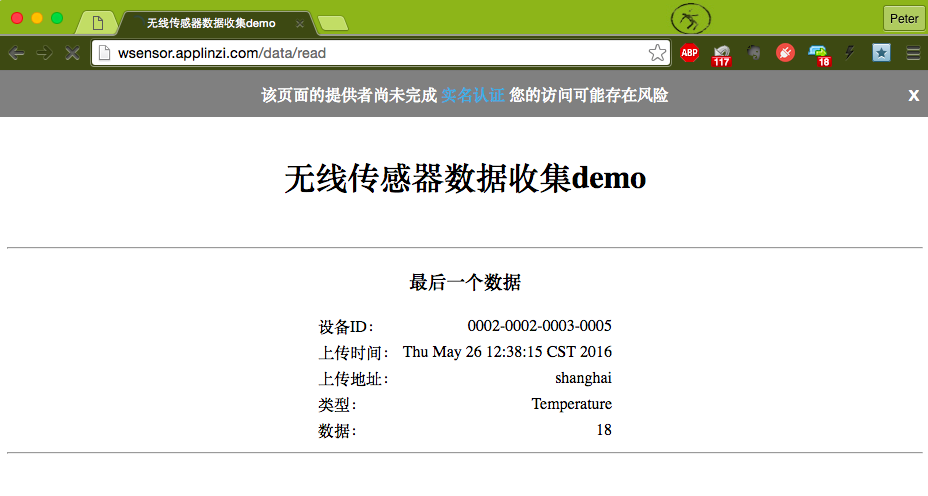
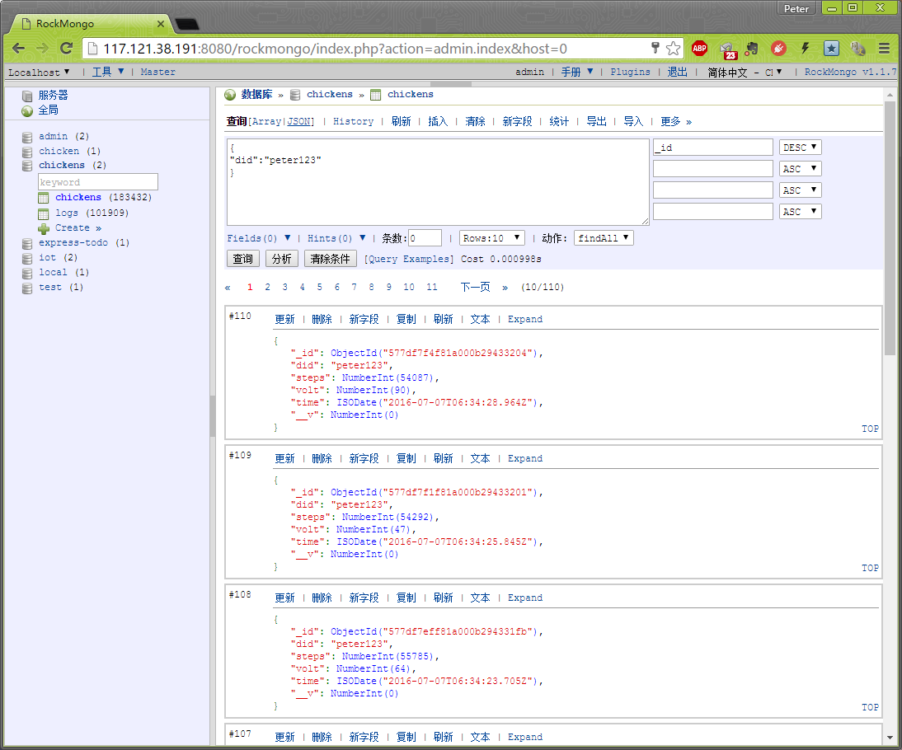

#SIMCOM800

SIMCOM800(C) is a GSM/GPRS module.  
This demos how Cannon drives a SIMCOM800 to achieve two things:

- make a phone call.
- post a HTTP JSON data to a sever.

##Set up the evironment
Prepare the boards



The SIMCOM800 module can be purchased at [here](https://item.taobao.com/item.htm?spm=a1z09.2.0.0.PF3rCc&id=523182226729&_u=7c7p15c78c2).  

Connect each other with UART. In this case, UART2 is used for transmitting AT commands, whereas UART1 is used for printing logs.

##AT commands Introducation
###1. Make a phone call
AT commands and response are listed below:

```
    //1. call
        ATD18621797323;
        OK

    //2. hanp up
        ATH
        OK
```


###2. HTTP POST data to a server
AT commands and response are listed below:

```
    //1. Open GPRS
        AT+SAPBR=3,1,"Contype","GPRS"
        OK
        AT+SAPBR=3,1,"APN","CMNET"
        OK
        AT+SAPBR=1,1
        OK
        AT+SAPBR=2,1
        +SAPBR: 1,1,"10.86.233.134"

    //2. Post a JSON data to the sever
        AT+HTTPINIT
        OK
        AT+HTTPPARA="CID",1
        OK
        AT+HTTPPARA="URL","http://117.121.38.191:3000/save_chicken"
        OK
        AT+HTTPPARA="CONTENT","application/json"
        OK
        AT+HTTPDATA=200,10000
        DOWNLOAD
        {"did":"peter123","steps":"53711","volt":"86"}
        OK
        AT+HTTPACTION=1
        OK
        +HTTPACTION: 1,200,1944
        AT+HTTPTERM
        OK

    //3. Close GPRS
        AT+SAPBR=0,1
        OK
```


Above AT commands of HTTP POST can be imitated by CURL tool :

```
curl -H "Content-Type: application/json" -X POST -d '{"did":"peter123", "steps":"56789", "volt":"99"}' http://117.121.38.191:3000/save_chicken    
```


##Application DEMO

###1. Code Flow

Please find details in [app.c](app.c):

- initialize the SIMCOM800 module
- Make a phone call
- HTTP POST data to a server (the server will store the data in database).


###2. Log captured

Please find details in [successful_AT_log.txt](successful_AT_log.txt):





###3. Check server database




##Usage

Include `sim800.h` in your project, API usages are described along with the function. 

Have fun.