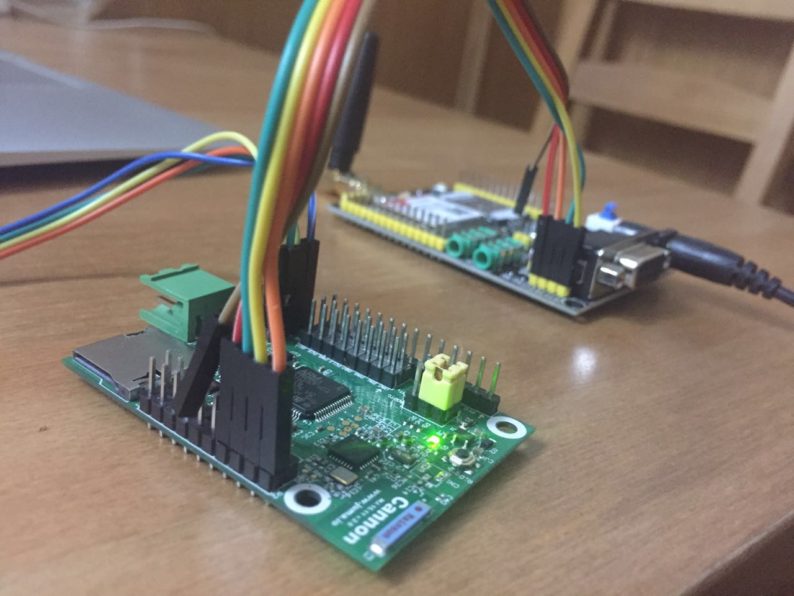

#SimCom800

SimCom800 is a GSM/GPRS module.  
This demos how Cannon drives a SimCom800 to achieve two things:

- make a phone call.
- post a HTTP JSON data to a sever.

##Set up the evironment
1. prepare the boards


2. connect each other with UART


The AT commands and response will be transmitted on the UART bus.

##Make a phone call
AT commands and response are listed below:

```
    //1. call
        ATD18621797323;
        OK

    //2. hanp up
        ATH
        OK
```


##HTTP demo
AT commands and response are listed below:

```
    //1. Open GPRS
        AT+SAPBR=3,1,"Contype","GPRS"
        OK
        AT+SAPBR=3,1,"APN","CMNET"
        OK
        AT+SAPBR=1,1
        OK
        AT+SAPBR=2,1
        +SAPBR: 1,1,"10.86.233.134"

    //2. Post a JSON data to the sever
        AT+HTTPINIT
        OK
        AT+HTTPPARA="CID",1
        OK
        AT+HTTPPARA="URL","http://wsensor.applinzi.com/data/write"
        OK
        AT+HTTPPARA="CONTENT","application/json"
        OK
        AT+HTTPDATA=200,10000
        DOWNLOAD
        {"SENSOR_ID":"0002-0002-0003-0005","SENSOR_TIME":"Thu May 26 12:38:15 CST 2016","SENSOR_LOCATION":"shanghai","SENSOR_TYPE":"Temperature", "SENSOR_DATA":"25"}
        OK
        AT+HTTPACTION=1
        OK
        +HTTPACTION: 1,200,1944
        AT+HTTPTERM
        OK

    //3. Close GPRS
        AT+SAPBR=0,1
        OK
```

Description:

1. send a JSON data to the sever, you can try it by CURL command as well:

```
curl -i -H "Accept: application/json" -H "Content-Type: application/json" -X POST -d '{"SENSOR_ID":"0002-0002-0003-0005", "SENSOR_TIME":"Thu May 26 12:38:15 CST 2016", "SENSOR_LOCATION":"上海", "SENSOR_TYPE":"Temperature", "SENSOR_DATA":"21°"}' http://wsensor.applinzi.com/data/write
```

2. you can see the data on the web page

open a browser and go to URL: [http://wsensor.applinzi.com/data/read](http://wsensor.applinzi.com/data/write)

Result shows below:

